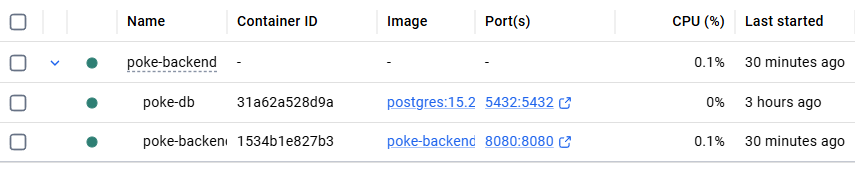
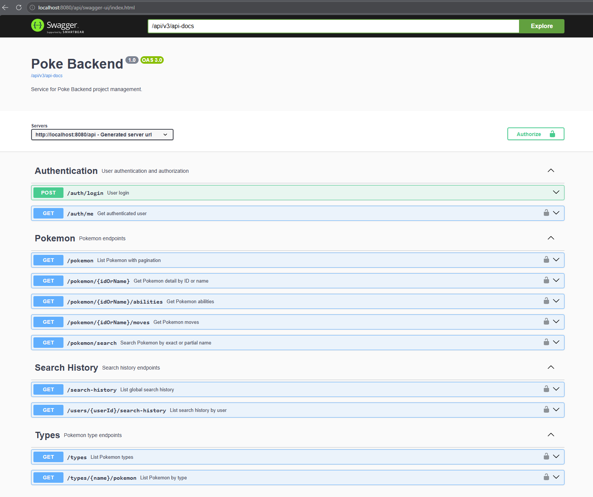
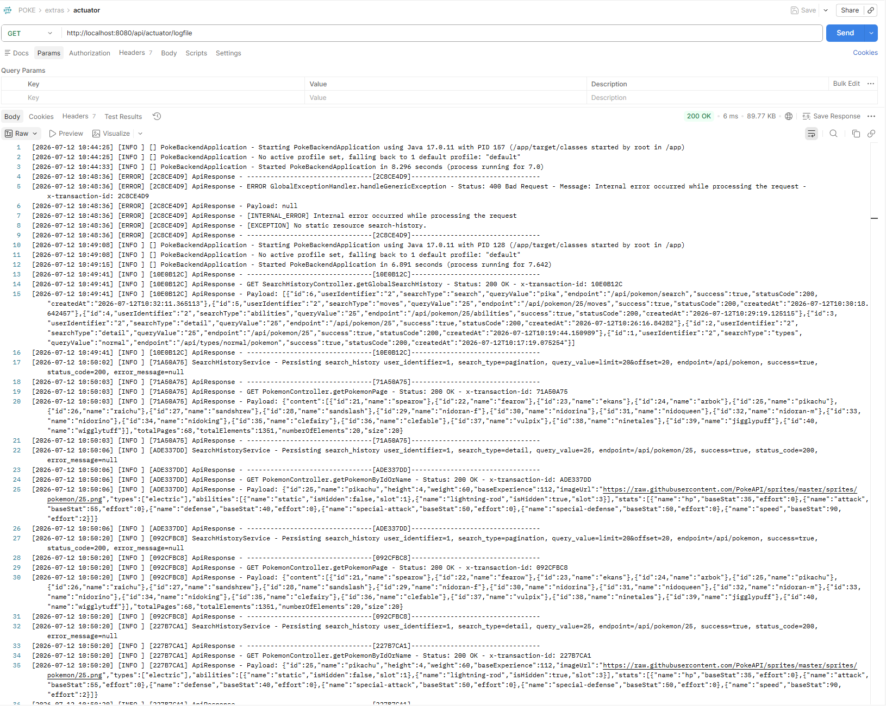
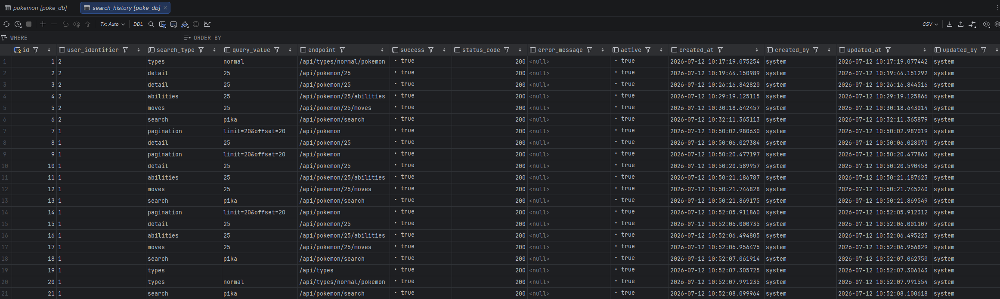
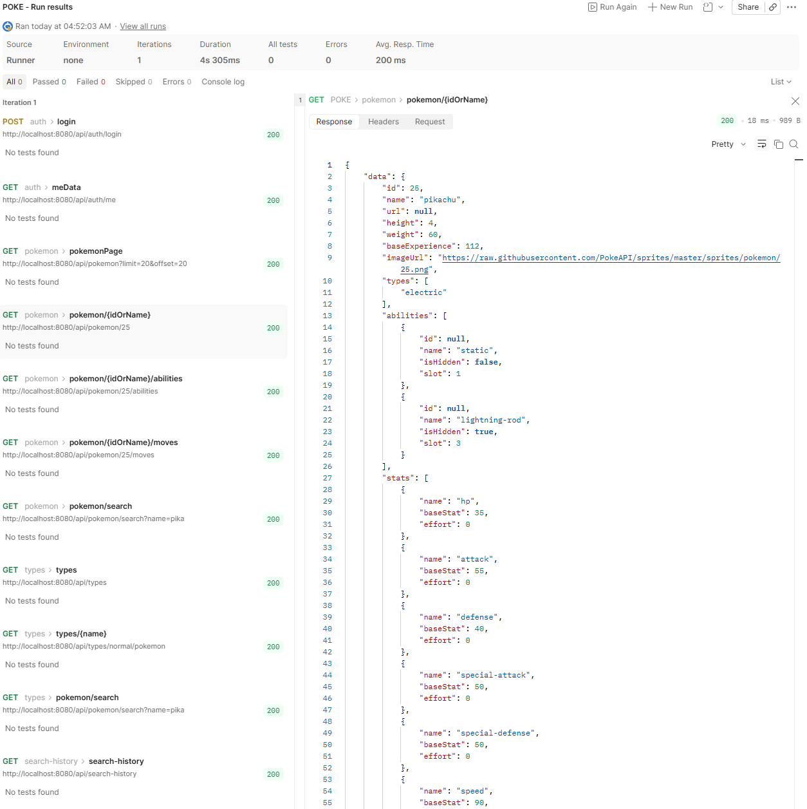

# Documentación

## Uso

1. Levanta la API.
2. Importa `POKE.postman_collection.json` en Postman.
3. Ejecuta `auth/login` una sola vez.
4. El token queda guardado en la variable de colección `{{token}}`.
5. A partir de ahí, el resto de requests usa ese token de forma automática.

## Recursos

### Auth
- `POST http://localhost:8080/api/auth/login`
- `GET http://localhost:8080/api/auth/me`

### Pokemon
- `GET http://localhost:8080/api/pokemon?limit=20&offset=0`
- `GET http://localhost:8080/api/pokemon/{idOrName}`
- `GET http://localhost:8080/api/pokemon/search?name={name}`
- `GET http://localhost:8080/api/pokemon/{idOrName}/abilities`
- `GET http://localhost:8080/api/pokemon/{idOrName}/moves`

### Types
- `GET http://localhost:8080/api/types`
- `GET http://localhost:8080/api/types/{name}/pokemon`

### Search History
- `GET http://localhost:8080/api/search-history`
- `GET http://localhost:8080/api/users/{userId}/search-history`

### Extras
- `GET http://localhost:8080/api/v3/api-docs`
- `GET http://localhost:8080/api/actuator/logfile`

## Colección

La colección Postman ya incluye un test en `auth/login` que guarda el JWT en `{{token}}`.

## Swagger

Para mayor detalle, revisa [Swagger UI](http://localhost:8080/api/swagger-ui/index.html).

## Capturas

